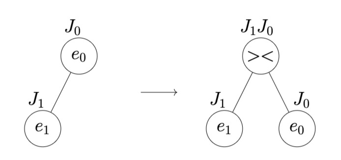
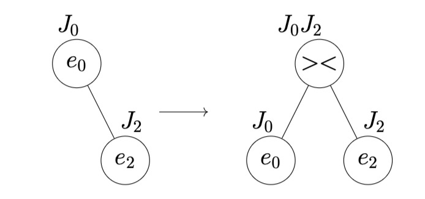
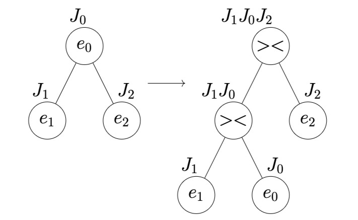

# Board Game Simulation
The goal is to simulate a board game. This game consists of a board (map), players and missions.

# Technologies & Data Structures
* **Language:** C
* **Data Structures:** Queue, Stack, Binary Search Tree (BST), Tournament Tree, Min-Heap, Max-Heap, Matrix
* **Algorithms:** A* Algorithm (Manhattan Distance), Tree Traversals/Conversions, Heap Operations
# About
This project simulates a board game, which consists of a map, players and missions. The goal is to lead players to victory through combat tournaments and by completing missions on an obstacle-filled map.
# Rules
* Each player is characterized by a name, a special ability and a unique energy level. Energy represents the primary resource required for both combat and movement.
* Players face off in elimination matches. The winner is the player with higher energy, who receives a bonus energy proportional to the difference between themselves and their opponent.
* The game map features open terrain and obstacles. Every step taken on the map consumes player energy based on the specific terrain cost of that tile.
* The top players from the tournament receive movement missions from a starting position to a final destination. A mission is successfully completed if the player finds the optimal parent and reaches the destination before running out of energy.

# Implementation details
**Map**:
The map contains traversable tiles and obstacle tiles. The map is represented as a grid of integer values:
* 0-Traversable tile
* 1-Obstacle tile
The input file for the map contains a grid that describes the values of each cell and the cost of moving from one cell to another (up, down, left, right). The data describing the map is organized as follows:
```text
val. tile (0,0)   | cost (0,0)-(0,1) | val. tile (0,1)   | cost (0,1)-(0,2) | val. tile (0,2)
------------------+------------------+-------------------+------------------+------------------
cost (0,0)-(1,0)  |                  | cost (0,1)-(1,1)  |                  | cost (0,2)-(1,2)
------------------+------------------+-------------------+------------------+------------------
val. tile (1,0)   | cost (1,0)-(1,1) | val. tile (1,1)   | cost (1,1)-(1,2) | val. tile (1,2)
------------------+------------------+-------------------+------------------+------------------
cost (1,0)-(2,0)  |                  | cost (1,1)-(2,1)  |                  | cost (1,2)-(2,2)
```

**Players**:
The following properties must be stored for each player:
* first_name, last_name
* energy
* ability (NEUTRALITATE (neutrality), REINCERCARE (retry), RENASTERE (rebirth))
* id
> Notes:
    - The id is a unique value assigned sequentially during data reading, starting from 0.
    - No two players share the same energy value.

**Missions:**
Players earn points by completing missions. Performing a mission involves finding a parent on the map from a starting point to a destination. Missions are defined by:
    - start_point (int[2])
    - end_point (int[2])
## 1. Player Registration & Organization
### Step 1.1
Player data is stored in the `jucatori.csv` file (located in the `Step_1` directory).

**Example input file (`jucatori.csv`):**
```text
PRENUME NUME; ENERGIE; ABILITATE
Mirel Alexandru; 15; NEUTRALITATE
Gabi Manea; 5; RENASTERE
Viorel-Bogdan Protop; 17; REINCERCARE
```

Data from the player input file is stored in a queue, implemented using a singly linked list. As each player's data is read from the file, an ID is assigned in ascending order. The output is displayed in `Step_1/ref_test_1_1.csv`.

### Step 1.2
The map described above is split into:
* tile values grid: cell values are extracted
* row costs grid: movement costs between horizontally adjacent tiles are extracted
* column costs grid: movement costs between vertically adjacent tiles are extracted.
Then, these are written to the `test_1_2.txt` file for further use.

**Example map input file: (`Step_1/harta.txt`)**<br>
```text
0  12  0  1  0
6      3     5
0  2   0  1  1
12     7     4
0  4   1  1  0
```

**Example map output file: (`Step_1/ref_test_1_2.txt`)**<br>
```text
0 0 0
0 0 1
0 1 0
6.00 3.00 5.00
12.00 7.00 4.00
12.00 1.00
2.00 1.00
4.00 1.00
```

### Step 1.3
Mission data is stored in the `Step_1/misiuni.csv`.
* `(Xi, Yi)`: represents the starting position of the player in the tile value grid.
* `(Xf, Yf)`: represents the target (final) position of the player in the tile value grid.

**Example input file:**
```text
Xi;Yi;Xf;Yf
2;0;0;0
0;0;0;2
```

Data read from the input file is stored in a stack. Then, details for each mission are written to the file, starting with the mission at the top of the stack.

**Example output file: (`Step_1/ref_test_1_3.csv`)**
```text
Xi;Yi;Xf;Yf
0;0;0;2
2;0;0;0
```

## 2. Battle between players
### Step 2.1
The players from Step 1 are inserted into a *Binary Search Tree (BST)* based on their **energy**, in the order they are dequeued from the player queue. The BST is then converted into a tournament tree.
The tournament tree can contain two types of nodes:
* player nodes: used to store player data.
* match nodes (><): used to pair up players who will compete against each other.

There are 4 subtree cases to consider during conversion:<br>
* **Case 1:** 
* **Case 2:** 
* **Case 3:** 
* **Case 4:** The subtree contains leaf nodes of type match. In this case, the same transformations as in the previous cases are applied.

> *Note: In the diagrams above, J refers to Jucător (Player), corresponding to P (Player 1, Player 2) in the English documentation.*

To validate the correct construction and post-order traversal of the tournament tree, an intermediate test was implemented, which is to output the post-order traversal (Left-Right-Root) of the tournament tree to `Step_2/ref_test_2_1.txt`.

**Example Output:**
```text
J1
J0
J1J0
J2
J1J0J2
```

Once the BST is converted into a tournament tree, matches can begin. Battles proceed bottom-up from leaf nodes toward the root until all matches have been resolved. Each match takes place between two children (players) of a match node and the winner is the player with higher energy. After a match, the parent match node receives the winning player's data. The winner's energy is increased by the absolute difference between the two contestants' energy levels:
$$E_{\text{winner}} = \max(E_{J1}, E_{J2}) + \vert{}E_{J1} - E_{J2}\vert{}$$

#### Time & Space Complexity
* **BST Creation**
  * **Time:** $\mathcal{O}(n \times h)$ — where $h = \log n$ (best case) or $h = n$ (worst case).
  * **Space:** $\mathcal{O}(n + h)$ — accounts for $n$ nodes and $\mathcal{O}(h)$ call stack depth.

* **Tournament Tree Construction**
  * **Time:** $\mathcal{O}(n \times k)$ — where $k$ is the string length processed by `snprintf`.
  * **Space:** $\mathcal{O}(n \times k + h)$ — accounts for nodes, string allocations and recursion stack.

### Step 2.2
The matches on the tournament tree are executed according to the rule presented above and the top $k$ winning players are displayed. Players will be selected only once, with their energy after their final match, in descending order.

After creating the tournament tree, it can be noticed that it is actually a Max-Heap (strictly in terms of energy levels), with each parent node's energy being greater than that of its children due to the formula used for the winning node's energy ($\max(E_1, E_2) + \vert{}E_1 - E_2\vert{}$). However, standard max-heap extraction cannot be used here. Once a winner (the maximum value) is extracted, the next maximum cannot simply be selected from that node's two children, because one of those child nodes is the exact same winner that was just extracted. 

Therefore, we build a separate max-heap containing the final (maximum) energies of each winner. We then create a max-heap that stores the ID and energy of each player using the buildHeap function. For each winner extraction, the root holds the highest value, which is removed, and the max-heap is restored using the heapifyDown function.

**Example output in `Step_2/ref_test_2_2.txt`:**
```text
J0 33.00
J2 17.00
```

#### Time & Space Complexity
* **Tree Traversal & Heap Construction:**
  * **Time Complexity:** $\mathcal{O}(n)$
  * **Space Complexity:** $\mathcal{O}(n)$ — required to store the $n$ player elements in the heap structure.

* **Extracting Top $k$ Winners:**
  * **Time Complexity:** $\mathcal{O}(k \log n)$ — where $n$ is the total number of players, as each of the $k$ extractions requires a `heapifyDown` operation of logarithmic height $\mathcal{O}(\log n)$.

* **Total Time Complexity:** $\mathcal{O}(n + k \log n)$

## Step 3
To complete missions, players find the shortest path using the **A* algorithm**. The processing order in the priority queue (Min-Heap) relies on the evaluation function:

$$f(n) = g(n) + \text{min \_cost} \times h(n)$$
Where:
* $g(n)$: Exact cost from the start node to node $n$.
* $h(n)$: Manhattan distance heuristic to destination $d$, defined as $|n.x - d.x| + |n.y - d.y|$.
* $\text{min \_cost}$: Minimum weight in the grid cost grid, ensuring the heuristic remains admissible for an optimal parent.

### Data Structures & Functions
* **Priority Queue (Min-Heap):** Pending nodes are stored in a Min-Heap ordered by their total estimated cost $f(n)$.
  * `addHeap()` + `heapifyUp()`: Inserts newly discovered or updated neighbor nodes.
  * `extract_min()` + `heapify_down_min()`: Pops the node with the lowest $f(n)$ value for expansion.
* **Path Reconstruction (`parent` grid):** A 2D parent-tracking grid (`parent`) stores the predecessor coordinates for each visited cell, allowing backward parent reconstruction once the target destination is reached.

### Execution Loop
While the Min-Heap is not empty:
1. Extract the node with the minimum $f(n)$ value.
2. Check if the extracted node is the target destination (terminate search if reached).
3. Explore valid adjacent neighbors (up to 4 cardinal directions).
4. Compute tentative $g(n)$ movement costs for each neighbor.
5. If a cheaper parent to a neighbor is discovered, update its costs, set its parent pointer in `parent` and push/update it inside the Min-Heap.

**Input:** The winners from `Step_2/ref_test_2_2.txt` are the ones who complete this mission.

**Output:**
The player ID, remaining energy and the path discovered by the A* algorithm (if a valid route exists) to `Step_3/ref_test_3.txt`.

**Output Format:**
`J<id> - energy: [xs, ys] -- [x1, y1] -- ... -- [xd, yd]`

**Example Output:**
```text
J0 - 21.00: [0, 0] -- [1, 0] -- [1, 1] -- [0, 1] -- [0, 2]
J2: Mission could not be executed
```

### Time & Space Complexity
* **Single $A^*$ Path Execution:**
  * **Time Complexity:** $\mathcal{O}(V \log V)$ — where $V = n \times m$ ($n$ rows, $m$ columns), accounting for Min-Heap priority queue operations on map tiles.
  * **Space Complexity:** $\mathcal{O}(V)$ — required to maintain node states, movement costs ($g, h, f$ scores) and parent tracking arrays.

* **Step 3 (Missions for Top $k$ Winners):**
  * **Time Complexity:** $\mathcal{O}(k \cdot V \log V)$ — running the $A^*$ pathfinding algorithm sequentially for each of the $k$ top players.
  * **Space Complexity:** $\mathcal{O}(V)$ — allocated dynamically per mission execution.

# Testing & Verification

To run the full test suite and verify the implementation:

```bash
cd checker
./checker.sh
```

> **Note:** The script compares the generated output files (e.g., `Step_3/ref_test_3.txt`) with the expected results located in the test directory to ensure correct execution.
